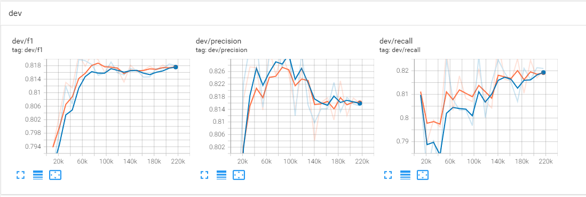
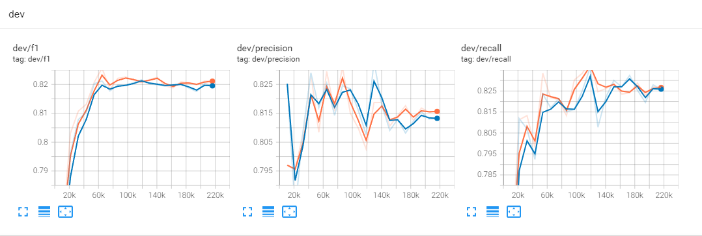

# GPLinker_pytorch
GPLinker_pytorch

# 介绍
这是pytorch版本的`GPLinker`代码以及`TPLinker_Plus`代码。
- `GPLinker`主要参考了[苏神博客](https://kexue.fm/archives/8888)和[他的keras版本代码](https://github.com/bojone/bert4keras/tree/master/examples/task_relation_extraction_gplinker.py)
- `TPLinker_Plus`主要参考了[原版代码](https://github.com/131250208/TPlinker-joint-extraction/tree/master/tplinker_plus)
- 其中`TPLinker_Plus`代码在模型部分可能有点区别。

# 更新
- 2022/03/03 添加`tplinker_plus`+`bert-base-chinese`权重在`duie_v1`上的结果。添加`duee_v1`任务的训练代码，请查看`duee_v1目录`。
- 2022/03/01 添加`tplinker_plus`+`hfl/chinese-roberta-wwm-ext`权重在`duie_v1`上的结果。
- 2022/02/25 现已在Dev分支更新最新的huggingface全家桶版本的代码，main分支是之前旧的代码（执行效率慢）

# 结果
Tips: 在`RTX3090`，`20epoch`的条件下，`gplinker`需要训练`5-6h`，`tplinker_plus`则需要训练`16-17h`。
|dataset        | method        | pretrained_model_name_or_path | f1                 | precision          | recall             |
|-------------- | ------------- | ----------------------------- | ------------------ | ------------------ | ------------------ |
|duie_v1        | gplinker      | hfl/chinese-roberta-wwm-ext   | 0.8214065255731926 | 0.8250077498782166 | 0.8178366038895478 |
|duie_v1        | gplinker      | bert-base-chinese             | 0.8198087178424598 | 0.8146470447994109 | 0.8250362175688137 |
|duie_v1        | tplinker_plus | hfl/chinese-roberta-wwm-ext   | 0.8256425523469291 | 0.8295114656031908 | 0.8218095614381671 |
|duie_v1        | tplinker_plus | bert-base-chinese             | 0.8216261688290682 | 0.8076458240569943 | 0.8360990385881737 |


# Tensorboard日志
## gplinker训练日志
<p align="left">
    
</p>

## tplinker_plus训练日志
<p align="left">
    
</p>


# 依赖
所需的依赖如下：
- fastcore==1.3.29
- datasets==1.18.3
- transformers>=4.16.2
- accelerate==0.5.1
- chinesebert==0.2.1

安装依赖requirements.txt
```bash
pip install -r requirements.txt
```
# 准备数据
从 http://ai.baidu.com/broad/download?dataset=sked 下载数据。

将`train_data.json`和`dev_data.json`压缩成`spo.zip`文件，并且放入`data`文件夹。

当前`data/spo.zip`文件是本人提供精简后的数据集，其中`train_data.json`只有2000条数据，`dev_data.json`只有200条数据。

# 运行
```bash
accelerate launch train.py \
    --model_type bert \
    --pretrained_model_name_or_path bert-base-chinese \
    --method gplinker \
    --logging_steps 200 \
    --num_train_epochs 20 \
    --learning_rate 3e-5 \
    --num_warmup_steps_or_radios 0.1 \
    --gradient_accumulation_steps 1 \
    --per_device_train_batch_size 16 \
    --per_device_eval_batch_size 32 \
    --seed 42 \
    --save_steps 10804 \
    --output_dir ./outputs \
    --max_length 128 \
    --topk 1 \
    --num_workers 6
```
其中使用到参数介绍如下：
- `model_type`: 表示模型架构类型，像`bert-base-chinese`、`hfl/chinese-roberta-wwm-ext`模型都是基于`bert`架构，`junnyu/roformer_chinese_char_base`是基于`roformer`架构，可选择`["bert", "roformer", "chinesebert"]`。
- `pretrained_model_name_or_path`: 表示加载的预训练模型权重，可以是本地目录，也可以是`huggingface.co`的路径。
- `method`: 表示使用的方法, 可选择`["gplinker", "tplinker_plus"]`
- `logging_steps`: 日志打印的间隔，默认为`200`。
- `num_train_epochs`: 训练轮数，默认为`20`。
- `learning_rate`: 学习率，默认为`3e-5`。
- `num_warmup_steps_or_radios`: `warmup`步数或者比率，当为`浮点类型`时候表示的是`radio`，当为`整型`时候表示的是`step`，默认为`0.1`。
- `gradient_accumulation_steps`: 梯度累计的步数，默认为`1`。
- `per_device_train_batch_size`: 训练的batch_size，默认为`16`。
- `per_device_eval_batch_size`: 评估的batch_size，默认为`32`。
- `seed`: 随机种子，以便于复现，默认为`42`。
- `save_steps`: 保存步数，每隔多少步保存模型。
- `output_dir`: 模型输出路径。
- `max_length`: 句子的最大长度，当大于这个长度时候，`tokenizer`会进行截断处理。
- `topk`: 保存`topk`个数模型，默认为`1`。
- `num_workers`: `dataloader`的`num_workers`参数，`linux`系统下发现`GPU`使用率不高的时候可以尝试设置这个参数大于`0`，而`windows`下最好设置为`0`，不然会报错。
- `use_efficient`: 是否使用`EfficientGlobalPointer`，默认为`False`。

# Reference
- 苏剑林. (Jan. 30, 2022). 《GPLinker：基于GlobalPointer的实体关系联合抽取 》[Blog post]. Retrieved from https://kexue.fm/archives/8888
- https://github.com/bojone/GPLinker
- https://github.com/bojone/bert4keras/tree/master/examples/task_relation_extraction_gplinker.py
- https://github.com/131250208/TPlinker-joint-extraction/tree/master/tplinker_plus